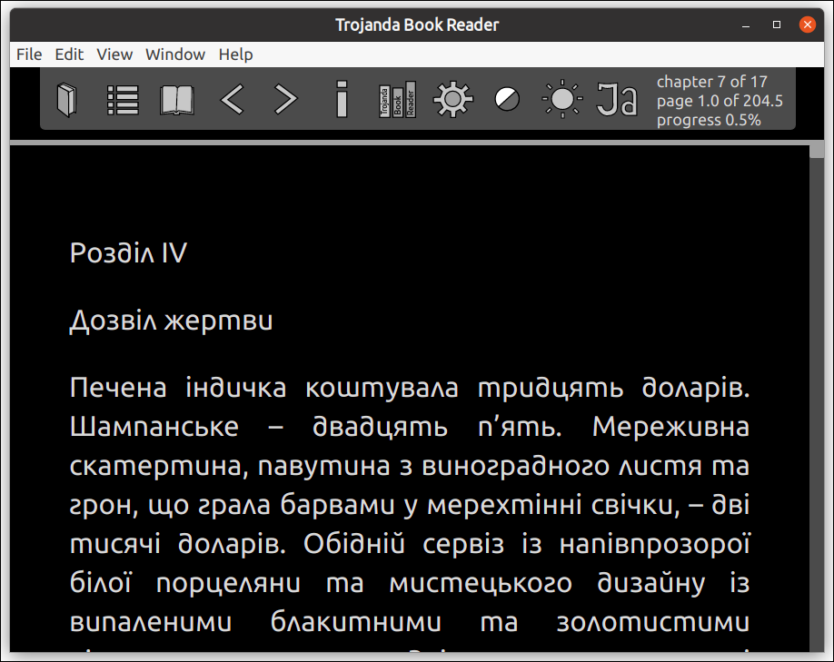
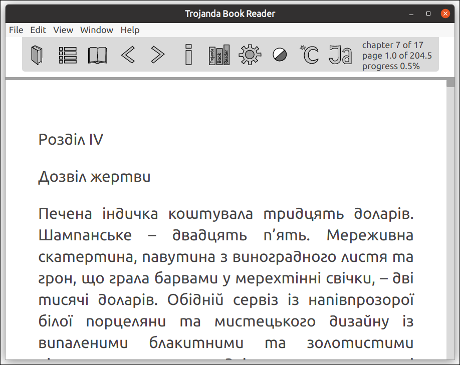

Trojanda Book Reader
====================

 A ePub reader application. It's written on Electron with usage of TypeScript.

Dark mode:


Light mode:


Dark romanized mode:


INSTALLATION
------------
```
git clone git@github.com:Victorq10/trojanda-book-reader.git
cd trojanda-book-reader
npm install
npm run build
npm run start
```

WORK IN THE VISUAL STUDIO CODE IDE
----------------------------------
```
cd trojanda-book-reader
code trojanda-book-reader.code-workspace 
```
Open terminal in the Code and run a command to compile *.ts files on save:
```
npm run watch
```

Open Debuger drop-down menu and select `Debug Main Process (trojanda-book-reader)`

USED VERSIONS
-------------
```
$ node --version
v10.20.1

$ sqlite3 --version
3.31.1 2020-01-27 19:55:54 3bfa9cc97da10598521b342961df8f5f68c7388fa117345eeb516eaa837balt1

$ code --version
1.46.0
a5d1cc28bb5da32ec67e86cc50f84c67cc690321
x64
```

Possible version incompatability
--------------------------------
if you have trable with `better-sqlite3` version compatability with `electron`.
You need to run a command
> $(npm bin)/electron-rebuild

##### Some details from the https://www.npmjs.com/package/better-sqlite3
> npm install better-sqlite3                — https://github.com/JoshuaWise/better-sqlite3/blob/HEAD/docs/troubleshooting.md \
> npm install --save-dev electron-rebuild   — https://www.npmjs.com/package/electron-rebuild \
> $(npm bin)/electron-rebuild

VESUAL STUDIO CODE CONFIGURATION
--------------------------------
##### Command line tools:
> sqlite3 — install with synaptic package manager in the Ubuntu 20.04.

Press `ctrl+shift+P` in the `Visual Studio Code` and start to type `sqlite` than select `SQLite: Open Database`. 
Select `testBook.db` or `Books.db` from the drop-down. Repeate for anothor database.
An `SQLITE EXPLORER` will be appear in the left side of you `Visual Studio Code` in the `Explorer`.

##### Visual Studio Code plugins:
* A “[formate: CSS/LESS/SCSS formatter](https://marketplace.visualstudio.com/items?itemName=MikeBovenlander.formate)” plugin to format css files.
* A [SQLite](https://marketplace.visualstudio.com/items?itemName=alexcvzz.vscode-sqlite) 
  plugin to view SQLite database (it require `sqlite3` command line tool).

NAME CONVENTIONS
----------------
snale cace (or Underscope) is used for variable, instances, parameters and function names. 

CamelCaces is used for Types, Classes, Enums etc.

See: [Snake case](https://en.wikipedia.org/wiki/Snake_case) on Wikipedia. and [Python: Naming Conventions](https://www.python.org/dev/peps/pep-0008/#naming-conventions) (5 007 026 views • published 30 трав. 2017 р.)

At least one study found that readers can recognise snake case values more quickly than camelCase:
[Sharif, Bonita; Maletic, Jonathan I. (2010). "An Eye Tracking Study on camelCase and under_score Identifier Styles"](http://www.cs.kent.edu/~jmaletic/papers/ICPC2010-CamelCaseUnderScoreClouds.pdf)

History of usage of identifiers in the CSS and DOM elements https://developer.mozilla.org/en-US/docs/Archive/Beginner_tutorials/Underscores_in_class_and_ID_Names. Why it is **dash** and not **underscope** symbol.

Some links to other standarts of Code conventions 
- https://standardjs.com/ 
- https://www.jetbrains.com/help/webstorm/settings-code-style-javascript.html
- https://github.com/airbnb/javascript
- https://google.github.io/styleguide/jsguide.html


OTHER APPLICATIONS FOR DEVELOPMENT ENVIRONMENT
==============================================

DATABASE APPLICATIONS
----------------------
Mainly I use this **SQuirreL SQL** and **DB Browser for SQLite** for `sqlite.db` files.

- http://squirrel-sql.sourceforge.net/                        — Universal SQL Client 
- https://sqlitebrowser.org/                                  — DB Browser for SQLite
- https://dbeaver.io/                                         — Free Universal Database Tool
- https://www.beekeeperstudio.io/ — **I just here about it**  — Open Source SQL Editor and Database Manager (on electron with usage vue framefork. A repository is https://github.com/beekeeper-studio/beekeeper-studio)


SVG IMAGES
-----------
I used `Inkscape` Vector Graphics Editor for creating icons in the `Trojanda Book Application`.

Anothe editor is https://boxy-svg.com/. It has even browser version of editor (Live demo). Which you can open from his home page https://boxy-svg.com/app/-LYzdDlq8VjMN2Bl9HUD

With https://www.pencil2d.org/ editor you can create even animation with sound tracks. 

There are some intresting video about animation “12 Principles of Animation (Official Full Series)” https://www.youtube.com/watch?v=uDqjIdI4bF4


RESEARCH INFORMATION
====================

There are some result of investigation about packages needed for `Trojanda Book Reader` project.

ZIP PACKAGES
------------
adm-zip
jsZip
UnZip

> hejoshwolfe/yauzl           — https://github.com/thejoshwolfe/yauzl \
> antelle/node-stream-zip     — https://github.com/antelle/node-stream-zip \
> ZJONSSON/node-unzipper      — https://github.com/ZJONSSON/node-unzipper \
> EvanOxfeld/node-unzip       — https://github.com/EvanOxfeld/node-unzip \
> Stuk/jszip                  — https://github.com/Stuk/jszip \
> kriskowal/zip               — https://github.com/kriskowal/zip

see <https://blog.csdn.net/meimeilive/article/details/103150412> and
https://github.com/open-xml-templating/pizzip/blob/master/documentation/howto/read_zip.md
- import PizZip from 'pizzip'
- import JSZipUtils from 'jszip-utils'

DOM PACKAGES
------------
- https://github.com/cheeriojs/cheerio
- https://github.com/fb55/DomHandler          — https://www.npmjs.com/package/domhandler
- https://github.com/fb55/domutils
- https://github.com/fb55/htmlparser2         — https://www.npmjs.com/package/htmlparser2
- https://github.com/stfsy/node-html-light    — https://www.npmjs.com/package/node-html-light
- https://github.com/douzi8/htmldom           — https://www.npmjs.com/package/htmldom
- https://github.com/facebook/react           — https://www.npmjs.com/package/react-dom

CHANGE_LOG GENERATOR
--------------------
https://www.npmjs.com/search?q=github_changelog_generator

Create file "scripts/changelog" wish content:
```
#!/usr/bin/env bash
#  gem install github_changelog_generator
github_changelog_generator -u fgribreau -p node-unidecode
```
ICONS SET
-----------
A project which combine many packages https://github.com/oblador/react-native-vector-icons — example page is here https://oblador.github.io/react-native-vector-icons/ you can see used icon packages in the package.json. There are some of 
them:
- https://github.com/kenangundogan/fontisto
- https://github.com/evil-icons/evil-icons
- https://github.com/ionic-team/ionicons

And another:
- https://github.com/DiemenDesign/LibreICONS

Using icon package sets and use them to create Android or iOS application is placed in the https://github.com/WrathChaos/react-native-dynamic-vector-icons repository

NOT RELATED REVIEW OF CLojure LANGUAGE
--------------------------------------
A project https://github.com/razum2um/awesome-clojure collects a collection of projects are written on Clojure language.
It amazing.

A spec Guide of Clojure language https://clojure.org/guides/spec

DOCUMANTATION RESOURCES
-----------------------
- https://www.typescriptlang.org/docs/home.html
- https://developer.mozilla.org/uk/


RESOURCES
---------
- https://matthewhorne.me/setup-typescript-project/
- https://sqlite.org/cli.html
- https://derickbailey.com/2016/03/09/creating-a-true-singleton-in-node-js-with-es6-symbols/
- https://nodejs.org/api/esm.html#esm_writing_dual_packages_while_avoiding_or_minimizing_hazards
- https://css-tricks.com/examples/WebKitScrollbars/
- https://developer.mozilla.org/en-US/docs/Web/Accessibility/Keyboard-navigable_JavaScript_widgets
- https://en.wikipedia.org/wiki/Cyrillic_script_in_Unicode
